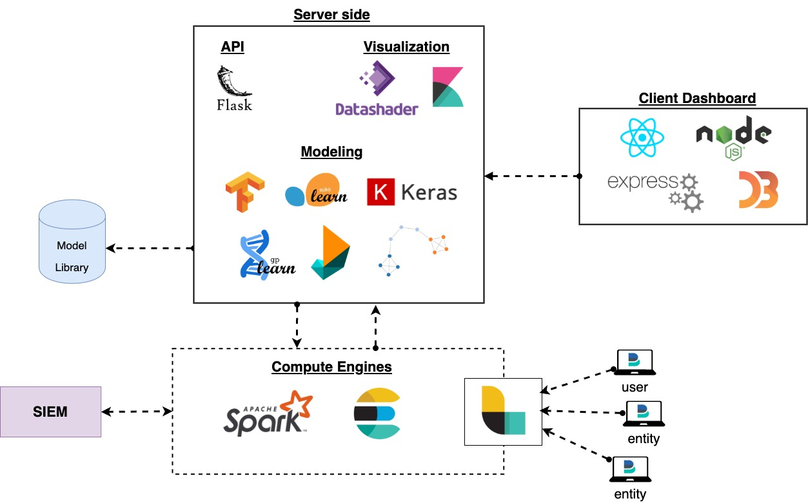

# OpenUBA
A robust, and flexible open source User & Entity Behavior Analytics (UEBA) framework. Developed with luv by Data Scientists & Security Analysts from the Cyber Security Industry

| Status Type | Status |
| --- | --- |
| `Master Build` |  |
| `Development Build` |  |
| `Issues` |  |
| `Last Commit` |  |
| `UI Docker Stars` |  |
| `UI Docker Pulls` |  |
| `UI Docker Automated` |  |
| `UI Docker Build` |  |
| `Server Docker Stars` |  |
| `Server Docker Pulls` |  |
| `Server Docker Automated` |  |
| `Server Docker Build` |  |
| `License` |  |
| `Releases` |  |
| `Latest Release` |  |
| `Top Language` |  |
| `Code Size` |  |
| `Chat` |  |

## Goals
To Build a lightweight, SIEM Agnostic, UEBA Framework focused on providing:
- Model Management
- Community-driven Model Library
- Model Versioning
- Dashboard
- Rule Storage/Management
- Case Management
- Peer-oriented/community intel
- Lightweight, SIEM-agnostic infrastructure
- Flexible/open dataset support
- Alerting/Ticketing system

## Components
- Client Dashboard
  - React
  - Bootstrap
  - Node JS
  - Express JS
  - D3.js
- Model Server (Remote or Local)
- User Interface
- API Server
  - Flask
- Visualization
  - Data Shader
  - Kibana
- Modeling
  - Tensorflow
  - Sci-kit Learn
  - Keras
  - GP Learn
  - DEAP
  - Network X
  - MLLib
- Compute Engine
  - Spark
  - Elastic Search
- Log Transport
  - Logstash
-Log Collection
  - Beats
- Supported Data Formats (for now)
  - CSV
  - Parquet
  - Flat File

# User Interface (placeholder, UI being updated now)
The interface is meant to observe system events, and anomalies

## Views
- Dashboard (index)
- Anomalies
- Cases
- Data
- Modeling
- Settings

## Installation/Usage
Go to [INSTALL.md](https://github.com/GACWR/OpenUBA/blob/master/docs/INSTALL.md)

## Get the updated code & documentation on XS code [here](https://cp.xscode.com/GACWR/OpenUBA)
Our main development, and documentation branches are first pushed to our sponsorship repository, and then eventually pushed to our public free repository. To obtain the most updated code, and documentation for OpenUBA, subscribe to our XS Code repository.

# Discord
Discord channel: https://discord.gg/Ps9p9Wy

# Telegram
Telegram: https://t.me/GACWR
