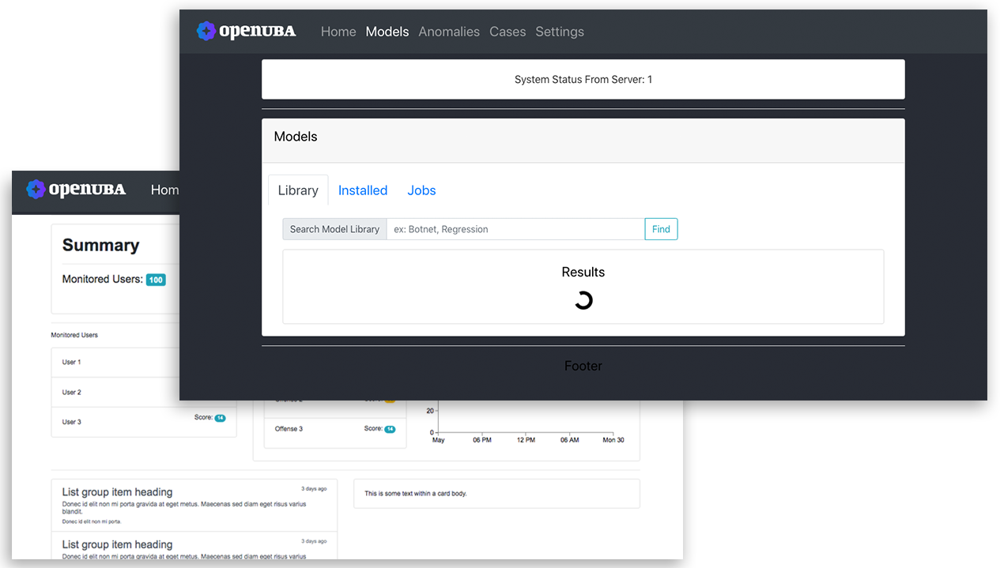

# OpenUBA
[](https://travis-ci.org/TomorrowSOC/OpenUBA)
[](https://github.com/TomorrowSOC/OpenUBA/issues)
[](https://github.com/TomorrowSOC/OpenUBA/commits/master)
[](https://github.com/TomorrowSOC/OpenUBA/blob/master/LICENSE)
[](https://github.com/TomorrowSOC/OpenUBA/releases)
[](https://github.com/TomorrowSOC/OpenUBA/releases)
[](https://github.com/TomorrowSOC/OpenUBA)
[](https://github.com/TomorrowSOC/OpenUBA)


## Get the updated code & documentation on XS code [here](https://cp.xscode.com/Tormorrow-SOC/OpenUB)
Our main development, and documentation branches are first pushed to our sponsorship repository, and then eventually pushed to our public free repository. To obtain the most updated code, and documentation for OpenUBA, subscribe to our XS Code repository.

```
https://cp.xscode.com/Tormorrow-SOC/OpenUB
```

## Goals
To Build a lightweight, SIEM Agnostic, UEBA Framework focused on providing:
- Model Management
- Community-driven Model Library
- Model Versioning
- Dashboard
- Rule Storage/Management
- Case Management
- Peer-oriented/community intel
- Lightweight, SIEM-agnostic infrastructure
- Flexible/open dataset support

## Components
- Model Client (optional)
- Model Server (Remote or Local)
- Transport Client
- User Inferface


# User Interface


The interface is meant to observe system events, and anomalies

## Views
- Dashboard (index)
- Anomalies
- Cases
- Data
- Modeling

## Installation
Go to [INSTALL.md](https://github.com/TomorrowSOC/OpenUBA/blob/master/docs/INSTALL.md)

# Discord
Discord channel: https://discord.gg/RVjVmyv

# Telegram
Telegram: https://t.me/tomorrowsoc
