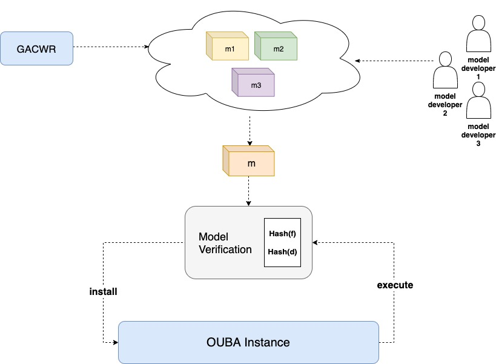

# Open User Behavior Analytics
A robust, and flexible open source User & Entity Behavior Analytics (UEBA) framework used for Security Analytics. Developed with luv by Data Scientists & Security Analysts from the Cyber Security Industry.

### White Paper
[source](https://github.com/GACWR/ouba-paper)

*This project is a work in progress and in a pre-alpha state; input and contributions are warmly welcome*

| Status Type | Status |
| --- | --- |
| `Master Build` |  |
| `Development Build` |  |
| `Issues` |  |
| `Closed Issues` |  |
| `Last Commit` |  |
| `Server Docker Stars` |  |
| `Server Docker Pulls` |  |
| `Server Docker Automated` |  |
| `Server Docker Build` |  |
| `License` |  |
| `Releases` |  |
| `Latest Release` |  |
| `Top Language` |  |
| `Code Size` |  |
| `Chat` |  |

## Problem
Many UBA platforms typically use a "black box" approach to data science practices, which may work best for security analysts who are not interested in the nuts and bolts of the underlying models being used to generate anomalies, baselines, and cases. These platforms view their models as IP.

# solution
OUBA takes an "open-model" approach, and is designed for the small subset of security analysts who have authentic curiosity about what models are doing, and how they work under the hood. We believe in the scientific computing community, and its contributions over the years (libraries, toolkits, etc). In security, rule/model transparency is key, for compliance, response/investigation, and decision making.

To take it a step further, OUBA also makes use of a community driven marketplace for models, similar to a plugin-store, where plugins are security models. This marketplace is where users of OUBA can install security models for their own use cases. Model developers can also upload their models, enabling other OUBA users to reuse them, whether for free, or compensation -- the choice is up to the model developer to make.

## Architecture

## Goals
To Build a lightweight, SIEM Agnostic, UEBA Framework focused on providing:
- Modeling
  - Model Management
  - Model Library (both community/internally driven)
  - Model Version Control
  - Ready-to-use model modules
  - Feedback Loop for continuous model training
  - "Shadow Mode" for model and risk score experimentation
  - Simple model configuration workflow
  - Model groups
  - Single-fire & Sequential models
  - "White-box" model standard
- Rule Engine
  - Single-fire & deviation-based rules
- Dashboard
  - Modern stack
  - Modular components
  - Live updating
  - Global state, and component state
- Features
  - Rule Storage/Management
  - Case Management
  - Peer-oriented/community intel
  - Lightweight, SIEM-agnostic architecture
  - Flexible/open dataset support
  - Alerting
  - Browser & desktop applications

## Stack
- Client Dashboard
  - React
  - Bootstrap
  - Node JS
  - Express JS
  - D3.js
- Model Server (Remote or Local)
- API Server
  - Flask
- Visualization
  - Data Shader
  - Kibana
  - Matplotlib
  - NetworkX
- Modeling
  - Tensorflow
  - Scikit Learn
  - Keras
  - GP Learn
  - DEAP
  - Graphx
  - MLlib
- Compute Engine
  - Spark
  - Elastic Search
- Supported Data Formats (for now)
  - CSV
  - Parquet
  - Flat File

# Interface (under active development)

## Views
- Dashboard (index)
- Models
- Anomalies
- Cases
- Settings

# Model Library
OpenUBA implements a model library purposed with hosting "ready-to-use" models, both developed by us, and the community. For starters, we host the default model repository, similar to any popular package manager (npm, cargo, etc). However, developers can host their own model repository for use in their own instance of OpenUBA.

## Model Library Workflow:

## Installation/Usage
Go to [INSTALL.md](https://github.com/GACWR/OpenUBA/blob/master/docs/INSTALL.md)

## Get the updated code & documentation on XS code [here](https://cp.xscode.com/GACWR/OpenUBA)
Our main development, and documentation branches are first pushed to our sponsorship repository, and then eventually pushed to our public free repository. To obtain the most updated code, and documentation for OpenUBA, subscribe to our XS Code repository.

## Twitter
http://twitter.com/OpenUBA

## Discord (Main Server, and Dev Chat)
Discord Server: https://discord.gg/Ps9p9Wy

## Telegram (Backup server, other communications)
Telegram: https://t.me/GACWR
