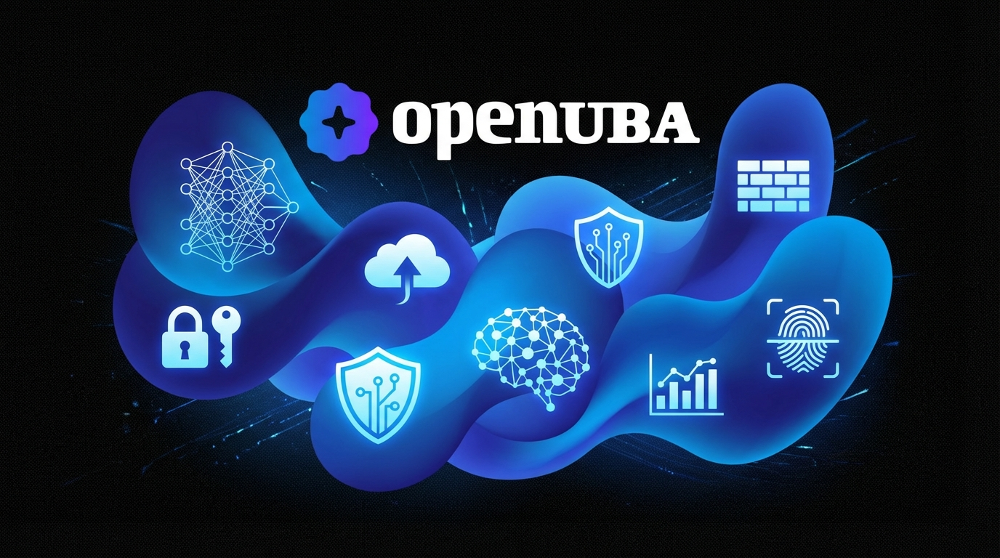
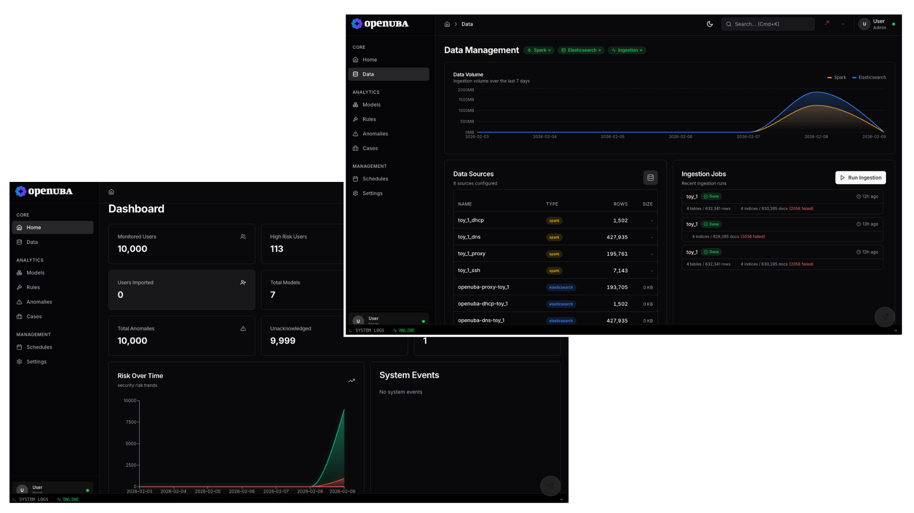
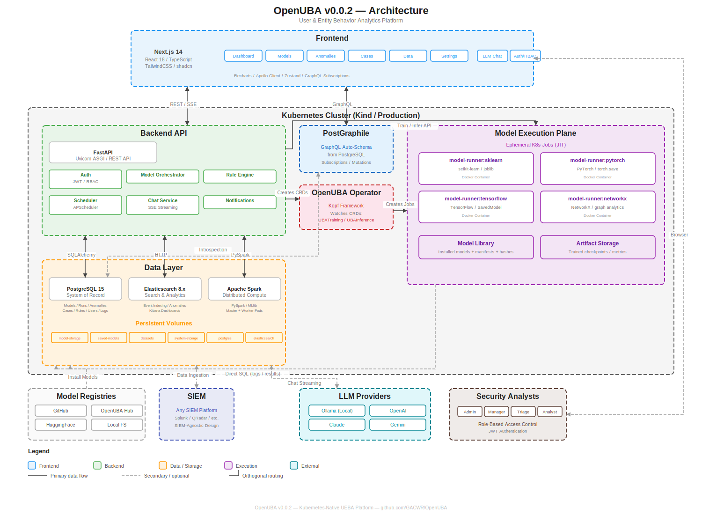
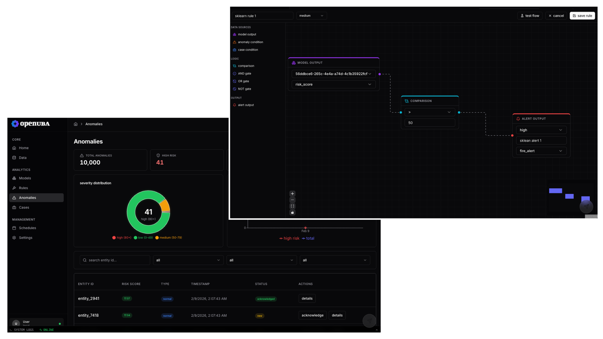
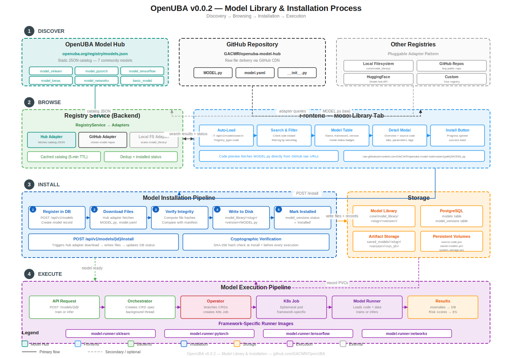
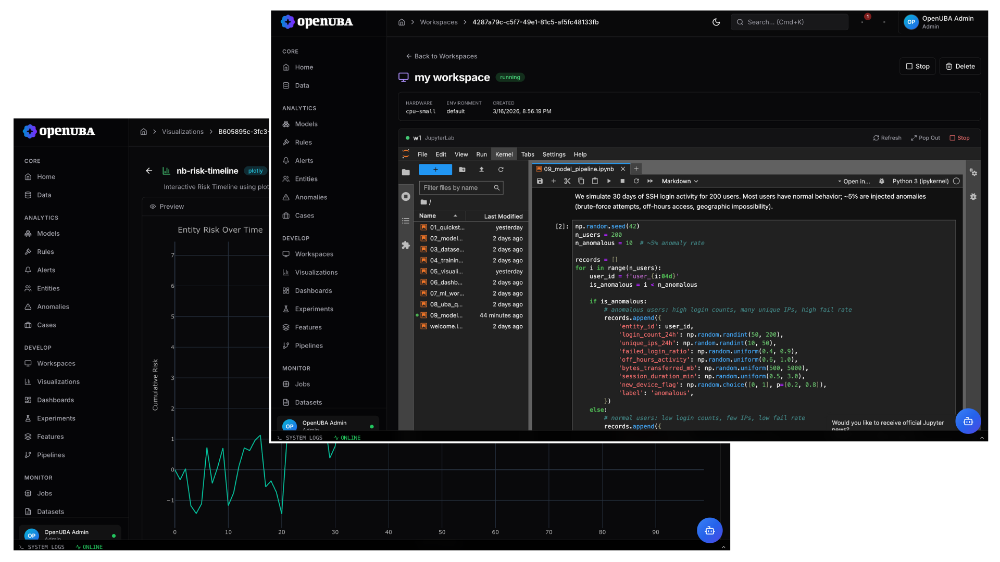

# Open User Behavior Analytics (v0.0.2)

A robust, flexible, and lightweight open source User & Entity Behavior Analytics (UEBA) framework used for Security Analytics. Developed with luv by Data Scientists & Security Analysts from the Cyber Security Industry.

| Status | Badge | Status | Badge |
| --- | --- | --- | --- |
| `Build` | [](https://github.com/GACWR/OpenUBA/actions) | `License` | [](https://github.com/GACWR/OpenUBA/blob/master/LICENSE) |
| `Issues` | [](https://github.com/GACWR/OpenUBA/issues) | `Closed Issues` | [](https://github.com/GACWR/OpenUBA/issues?q=is%3Aissue+is%3Aclosed) |
| `Pull Requests` | [](https://github.com/GACWR/OpenUBA/pulls) | `Last Commit` | [](https://github.com/GACWR/OpenUBA/commits/master) |
| `Top Language` | [](https://github.com/GACWR/OpenUBA) | `Code Size` | [](https://github.com/GACWR/OpenUBA) |
| `Repo Size` | [](https://github.com/GACWR/OpenUBA) | `Contributors` | [](https://github.com/GACWR/OpenUBA/graphs/contributors) |
| `Stars` | [](https://github.com/GACWR/OpenUBA/stargazers) | `Forks` | [](https://github.com/GACWR/OpenUBA/network/members) |
| `Releases` | [](https://github.com/GACWR/OpenUBA/releases) | `Platform` |  |
| `Python` |  | `TypeScript` |  |
| `FastAPI` |  | `Next.js` |  |
| `PostgreSQL` |  | `Kubernetes` |  |
| `Docker` | [](https://hub.docker.com/u/openuba) | `Spark` |  |
| `Elasticsearch` |  | `PRs Welcome` | [](https://github.com/GACWR/OpenUBA/pulls) |
| `Chat` |  | | |

---

## Table of Contents

- [Problem](#problem)
- [Solution](#solution)
- [Architecture](#architecture)
- [Tech Stack](#tech-stack)
- [Features](#features)
- [Rule Canvas](#rule-canvas)
- [Model Library](#model-library)
- [Model Execution Sandbox](#model-execution-sandbox)
- [Workspaces & SDK](#workspaces--sdk)
- [Authentication and Access Control](#authentication-and-access-control)
- [LLM Assistant](#llm-assistant)
- [Getting Started](#getting-started)
- [Development](#development)
- [Makefile Reference](#makefile-reference)
- [Testing](#testing)
- [White Paper](#white-paper)
- [Community](#community)
- [License](#license)

---

## Problem

Many UBA platforms typically use a "black box" approach to data science practices, which may work best for security analysts who are not interested in the nuts and bolts of the underlying models being used to generate anomalies, baselines, and cases. These platforms view their models as IP.

## Solution

OpenUBA takes an "open-model" approach, and is designed for the small subset of security analysts who have authentic curiosity about what models are doing, and how they work under the hood. We believe in the scientific computing community, and its contributions over the years (libraries, toolkits, etc). In security, rule/model transparency is key, for compliance, response/investigation, and decision making.

OpenUBA also makes use of a community-driven marketplace for models, similar to a plugin-store, where plugins are security models. This marketplace is where users of OpenUBA can install security models for their own use cases. Model developers can also upload their models, enabling other users to reuse them, whether for free or compensation -- the choice is up to the model developer to make.

---

<div align="center">
  
  <br /><br />
  <a href="https://youtu.be/tMppVt2v1nI?si=kyPrsZvQzHKxLZkf">
    
  </a>
</div>

---

## Architecture



OpenUBA v0.0.2 is a Kubernetes-native platform with a modular, cloud-native architecture. All components are containerized and deployable to a Kind cluster for development or a production Kubernetes cluster. The system is designed to remain lightweight -- no always-on per-model services, no heavy pipeline orchestrators, just the minimum infrastructure needed to run security analytics at scale.

| Layer | Description |
| --- | --- |
| **Frontend** | Next.js 14 React application with TailwindCSS, shadcn/ui components, and real-time GraphQL subscriptions |
| **Backend API** | FastAPI application exposing REST endpoints with JWT authentication, model orchestration, rule engine, and scheduling |
| **GraphQL** | PostGraphile auto-generates a full GraphQL API from the PostgreSQL schema, enabling subscriptions and efficient querying |
| **Operator** | Custom Kubernetes operator (Kopf) watches UBATraining and UBAInference CRDs and creates ephemeral Jobs |
| **Data Layer** | PostgreSQL (system of record), Elasticsearch (search/analytics), Apache Spark (distributed compute), backed by Persistent Volumes |
| **Execution Plane** | Ephemeral K8s Jobs using framework-specific Docker images (sklearn, pytorch, tensorflow, networkx) for JIT model training and inference |

---

## Tech Stack

### Frontend

| Component | Technology |
| --- | --- |
| Framework | Next.js 14.0.4 (App Router) |
| Language | TypeScript 5.3 |
| UI System | TailwindCSS 3.4, Radix UI primitives, class-variance-authority |
| Data Layer | Apollo Client 3.8 (GraphQL), Axios 1.6 (REST) |
| Real-time | GraphQL subscriptions via graphql-ws 5.14 |
| Charts | Recharts 3.5 |
| Rule Canvas | @xyflow/react 12.10 (flow-based node editor) |
| State | Zustand 4.5 (UI state), Apollo cache (server state) |
| Markdown | react-markdown 10.1, react-syntax-highlighter 16.1 |
| Command Palette | cmdk 0.2 |
| Icons | lucide-react 0.309 |

### Backend

| Component | Technology |
| --- | --- |
| Framework | FastAPI 0.104 (Uvicorn 0.24 ASGI) |
| Language | Python 3.9 (typed, Pydantic 2.5) |
| ORM | SQLAlchemy 2.0.23 |
| Auth | JWT (python-jose 3.3), bcrypt via passlib 1.7 |
| Scheduling | APScheduler 3.10 |
| GraphQL | PostGraphile (auto-schema from PostgreSQL) |
| Data Engines | PySpark 3.5, Elasticsearch client 8.11 |
| Container Clients | docker-py 6.1, kubernetes-client 28.1 |

### Infrastructure

| Component | Technology |
| --- | --- |
| Database | PostgreSQL 15 (Alpine) |
| Search | Elasticsearch 8.11.0 |
| Compute | Apache Spark 3.5.0 (Master + Worker) |
| Orchestration | Kubernetes (Kind for dev, any cluster for prod) |
| Operator | Custom OpenUBA Operator (Kopf, Python) |
| Containers | Docker (framework-specific model runner images) |
| Node.js Runtime | Node 18 (Alpine, multi-stage frontend build) |

### Modeling Frameworks

| Framework | Runner Image | Serialization |
| --- | --- | --- |
| scikit-learn | `model-runner:sklearn` | joblib |
| PyTorch | `model-runner:pytorch` | torch.save |
| TensorFlow / Keras | `model-runner:tensorflow` | SavedModel |
| NetworkX | `model-runner:networkx` | pickle |

---

## Features

### Modeling
- Model management with full lifecycle (install, train, infer)
- Model library with community and internally driven models
- Multi-registry support (GitHub, OpenUBA Hub, HuggingFace, Kubeflow, local filesystem)
- Model version control and artifact tracking
- Feedback loop for continuous model training
- "Shadow mode" for model and risk score experimentation
- Cryptographic hash verification at install and before every execution
- Framework-agnostic: supports sklearn, PyTorch, TensorFlow, Keras, NetworkX, Spark MLlib, and more
- "White-box" model standard -- every model is inspectable and auditable

### Rule Engine and Alerts
- Threshold-based and deviation-based detection rules
- Flow-graph rule logic with visual canvas for building complex rule circuits
- Rules compose model outputs with logical operators, serialized deterministically to the database
- Rule-triggered alerts linked to anomalies and cases
- Alerts can be enabled or disabled per-rule

### Workspaces & SDK
- Launch managed JupyterLab environments from the UI with configurable hardware tiers
- Python SDK (`pip install openuba`) for programmatic model registration, job submission, and visualization
- Register sklearn, PyTorch, TensorFlow, and NetworkX models directly from notebooks
- Submit training and inference jobs with real-time SSE progress streaming
- Multi-backend visualization rendering (matplotlib, seaborn, plotly, bokeh, altair, plotnine, datashader, networkx, geopandas)
- Workspace lifecycle managed by the K8s operator via UBAWorkspace CRDs

### Dashboard
- Modern Next.js + shadcn/ui interface with dark mode default
- Real-time updates via GraphQL subscriptions
- Global time range selector, command palette, and keyboard navigation
- Modular components with responsive layout
- Pages: Home, Data, Models, Rules, Alerts, Entities, Anomalies, Cases, Workspaces, Visualizations, Dashboards, Experiments, Features, Pipelines, Jobs, Datasets

### Security and Access Control
- JWT authentication with role-based access control (admin, manager, triage, analyst)
- Per-page granular permissions (read/write) configurable by admins
- Persistent notifications system
- Audit logging for compliance

### Core Capabilities
- Case management with anomaly linking and timeline
- Anomaly detection result browsing, filtering, and acknowledgment
- Entity management and risk tracking
- Data source management with ingestion status monitoring
- SIEM-agnostic architecture with flexible dataset support
- Integrated LLM assistant for contextual analysis
- Alerting and notification system
- Cron-based scheduling for automated model execution

---

## Rule Canvas

OpenUBA includes a visual flow-based rule builder for creating detection logic. Rules compose model outputs with logical operators on an interactive canvas, similar to tools like n8n or Node-RED but purpose-built for security analytics. Analysts can wire together registered models, define threshold conditions, and chain logical gates to express complex detection criteria -- all without writing code.

Each rule's flow graph is serialized deterministically into the database as a structured JSON object, making rules fully reproducible, version-trackable, and auditable. When a rule's conditions are met, it fires an alert that can be linked to anomalies and cases.

<div align="center">
  
</div>

---


## Model Library

OpenUBA implements a model library and marketplace for hosting "ready-to-use" security models, both developed by the core team and the community. The official model catalog is served from [openuba.org/registry/models.json](https://openuba.org/registry/models.json), backed by the [openuba-model-hub](https://github.com/GACWR/openuba-model-hub) repository. Developers can also host their own model registries or install models from any GitHub repository or local filesystem.

The library tab in the dashboard lets analysts browse, search, inspect, and install models with a single click. Clicking a model opens a detail modal showing its metadata, parameters, tags, dependencies, and full source code -- fetched directly from GitHub. Installation downloads the model files, verifies their integrity, writes them to the model library on disk, and registers them in PostgreSQL.



### Available Models (OpenUBA Hub)

| Model | Framework | Description |
| --- | --- | --- |
| `basic_model` | Python | Baseline example model for getting started |
| `model_sklearn` | scikit-learn | Isolation Forest anomaly detection |
| `model_pytorch` | PyTorch | Neural network-based behavior analysis |
| `model_tensorflow` | TensorFlow | Deep learning behavior model |
| `model_keras` | Keras | High-level API behavior model |
| `model_networkx` | NetworkX | Graph-based entity relationship analysis |
| `model_1` | Python | General-purpose analytics model |

### Model Interface

Models follow a simple Python interface. No heavy SDKs or complex pipeline definitions required -- model authors write straightforward Python logic using familiar libraries:

```python
class Model:
    def train(self, ctx):
        # Train model, return summary
        ...

    def infer(self, ctx):
        # Run inference, return risk scores as DataFrame
        ...
```

Each model package is a directory containing a `MODEL.py`, an optional `model.yaml` manifest, and an optional `requirements.txt`. The runner handles all I/O, database access, and framework-specific serialization (joblib for sklearn, torch.save for PyTorch, SavedModel for TensorFlow).

### Registry Adapters

The model registry uses a pluggable adapter pattern. Each adapter implements model discovery, listing, and downloading for its backend:

| Adapter | Source | Description |
| --- | --- | --- |
| OpenUBA Hub | `openuba.org` | Official model catalog with cached JSON registry (5-min TTL) |
| GitHub | Any repo | Clone and install models from GitHub repositories |
| Local Filesystem | `model_library/` | Scan locally installed models |
| HuggingFace | HF Hub | Model hub API integration (planned) |

### Data Loaders

Models can consume data from multiple sources through built-in data loader modules:

| Loader | Module | Description |
| --- | --- | --- |
| Local CSV | `local_pandas` | Reads CSV files via pandas |
| Elasticsearch | `es` | Queries Elasticsearch indices |
| Spark | `spark` | Distributed data via PySpark |
| Source Groups | `source_group` | Aggregated multi-source loading |

---

## Model Execution Sandbox

Every model execution runs inside an isolated Docker container or Kubernetes Job, separate from the main API. This provides:

- **Security** -- untrusted model code cannot compromise the core system
- **Isolation** -- each model gets its own environment with the right dependencies
- **Reliability** -- a misbehaving model is contained; resource limits prevent it from exhausting system resources
- **Scalability** -- multiple models can run in parallel as separate K8s Jobs

No long-lived per-model services. Every training and inference run is an ephemeral Job that spins up, executes, writes results, and exits. The only long-lived pieces are the operator, the backend, and the database.

The custom OpenUBA operator watches for `UBATraining` and `UBAInference` custom resources and creates Kubernetes Jobs with the appropriate framework-specific runner image. Input and output data flows through shared Persistent Volumes.

---

## Workspaces & SDK

OpenUBA includes managed JupyterLab workspaces that run as Kubernetes pods, giving analysts and data scientists a full notebook environment connected directly to the platform. From a workspace, you can register models, submit training and inference jobs, query results, and render visualizations -- all through the Python SDK.

```bash
pip install openuba
```

```python
import openuba

# register a trained sklearn model from a notebook
openuba.register_model("ssh-anomaly-detector", model, runtime="sklearn")

# submit a training job and poll until complete
openuba.start_training(model_id, dataset_id=dataset_id)

# run inference -- returns anomaly scores
openuba.start_inference(model_id, dataset_id=dataset_id)

# render a plotly visualization and push to the platform
openuba.render(fig, viz_id=viz_id)
```

The SDK supports 9 visualization backends out of the box. Any matplotlib, seaborn, plotly, bokeh, altair, plotnine, datashader, networkx, or geopandas figure can be rendered and pushed to the platform for display in the Visualizations page.

Workspaces are managed by the K8s operator via `UBAWorkspace` custom resources. Hardware tiers (`cpu-small`, `cpu-large`, `gpu-small`, `gpu-large`) control resource allocation. Each workspace gets its own persistent volume, pre-installed SDK, and API token for authenticated access to the platform.

<div align="center">
  
</div>

---

## Authentication and Access Control

OpenUBA v0.0.2 includes a complete authentication and role-based access control system:

| Role | Access |
| --- | --- |
| **Admin** | Full read/write access to all pages, user management, permission configuration |
| **Manager** | Read access to all pages |
| **Triage** | Home, rules, alerts, entities, cases only |
| **Analyst** | Home, data, models (read/write), rules (read/write), alerts, entities (read/write), anomalies (read/write) |

Default credentials: `openuba` / `password` (admin). Change immediately after first login.

---

## LLM Assistant

An always-available LLM chat overlay is built into the interface. It supports multiple providers:

| Provider | Type |
| --- | --- |
| Ollama | Local (default) |
| OpenAI | Cloud API |
| Claude | Cloud API |
| Gemini | Cloud API |

The assistant is context-aware -- it sees the current route, selected entities, and active filters. It can be toggled, dragged, and resized. Conversation history persists across page navigation. Configure providers under Settings > Integrations.

---

## Getting Started

### Prerequisites

| Requirement | Version |
| --- | --- |
| Docker | 20.10+ |
| kubectl | 1.25+ |
| Kind | 0.20+ |
| Node.js | 18+ |
| Python | 3.10+ |
| Make | any |

### Full Reset (Recommended)

The single command to build everything from scratch -- creates a Kind cluster, builds all Docker images, deploys all Kubernetes resources, initializes the database, ingests test data, and launches port-forwarding in separate terminal tabs:

```bash
make reset-dev
```

This is the go-to command for development. It tears down any existing cluster and stands up a clean environment end-to-end. Once complete, three terminal tabs will open automatically:

| Tab | Purpose | URL |
| --- | --- | --- |
| Hybrid Networking | Port-forwards all K8s services to localhost | -- |
| Local Backend | Runs the FastAPI backend with hot-reload | http://localhost:8000 |
| Local Frontend | Runs the Next.js dev server with hot-reload | http://localhost:3000 |

Log in with `openuba` / `password`.

### What `make reset-dev` Does

1. Deletes any existing Kind cluster
2. Cleans up old Docker images
3. Creates a new Kind cluster from `configs/local.yaml`
4. Builds all container images (backend, frontend, operator, base runner, sklearn, pytorch, tensorflow, networkx)
5. Loads images into the Kind cluster
6. Deploys all Kubernetes manifests (namespace, secrets, persistent volumes, Postgres, PostGraphile, Spark, Elasticsearch, backend, frontend, operator, CRDs, ingress)
7. Waits for pods to become ready
8. Triggers initial data ingestion (`toy_1` dataset into Spark and Elasticsearch)
9. Opens three terminal tabs for port-forwarding, backend, and frontend

### Alternative: Full Kubernetes Mode

If you prefer running everything inside the cluster (no local backend/frontend):

```bash
make create-local-cluster
make k8s-deploy
make k8s-forward
```

Access the application at http://localhost:3000.

### Alternative: Local Development Mode

Run backend and frontend locally against a local Postgres (no Kubernetes):

```bash
make dev-postgres
make setup-backend
make dev-install-frontend
make dev
```

### Port Reference

| Service | Local Port |
| --- | --- |
| Frontend | 3000 |
| Backend API | 8000 |
| PostgreSQL | 5432 |
| PostGraphile (GraphQL) | 5001 |
| Spark Master | 7077 (UI: 8080) |
| Elasticsearch | 9200 |

---

## Development

### Restarting Services

During development, you will frequently need to rebuild and restart individual services after code changes. These commands rebuild the Docker image, load it into the Kind cluster, and trigger a rolling restart:

```bash
# rebuild and restart the backend pod
make dev-restart-backend

# rebuild and restart the frontend pod
make dev-restart-frontend

# re-apply CRDs, RBAC, and restart the operator
make dev-restart-operator
```

For local (non-K8s) development:

```bash
make dev-restart-backend-local
make dev-restart-frontend-local
```

### Building Individual Images

```bash
make build-backend              # backend api server
make build-frontend             # next.js frontend
make build-operator             # kubernetes operator
make build-runner-base          # model runner base image
make build-runner-sklearn       # sklearn runner
make build-runner-torch         # pytorch runner
make build-runner-tf            # tensorflow runner
make build-runner-networkx      # networkx runner
make build-containers           # all of the above
```

### Viewing Logs

```bash
make k8s-logs-backend
make k8s-logs-frontend
make k8s-logs-spark
make k8s-logs-elasticsearch
make k8s-logs-postgraphile
make k8s-logs-all               # all services simultaneously
make watch-pods                 # live pod status
```

### Database

```bash
make init-db-k8s                # initialize schema in the K8s Postgres pod
make init-db-local              # initialize schema against local Postgres
make redeploy-db                # full Postgres redeploy with fresh schema
```

### Data Ingestion

```bash
make k8s-init-data              # ingest toy_1 dataset into Spark and Elasticsearch
```

The `test_datasets/toy_1/` directory contains real-world subsets of SSH, DNS, DHCP, and proxy logs. This dataset is treated as immutable -- it should never be modified. In production, users connect OpenUBA to their existing Spark or Elasticsearch clusters that already contain their datasets.

### Port Forwarding

```bash
make dev-hybrid                 # infrastructure only (Postgres, Spark, ES, PostGraphile)
make k8s-forward                # everything including backend and frontend
```

### Cleanup

```bash
make delete-local-cluster       # delete the Kind cluster
make clean-docker               # prune unused Docker resources
make clean-all                  # delete cluster + prune Docker
make clean-logs                 # remove local log files
make dev-stop                   # stop local Postgres container
```

---

## Makefile Reference

Every command in OpenUBA is run through the Makefile. Below is the complete reference:

### Core Workflow

| Target | Description |
| --- | --- |
| `reset-dev` | Full reset -- deletes cluster, rebuilds everything, deploys, and launches dev tabs |
| `create-infra` | Runs `scripts/start-dev.sh` (cluster + build + deploy + tabs) |
| `create-local-cluster` | Creates the Kind cluster from `configs/local.yaml` |
| `delete-local-cluster` | Deletes the Kind cluster |

### Build

| Target | Description |
| --- | --- |
| `build-containers` | Builds all Docker images (backend, frontend, operator, all runners) |
| `build-backend` | Builds the backend image |
| `build-frontend` | Builds the frontend image |
| `build-operator` | Builds the operator image |
| `build-model-runner` | Builds base + all framework runner images |
| `build-runner-base` | Builds the model runner base image |
| `build-runner-sklearn` | Builds the sklearn runner image |
| `build-runner-torch` | Builds the PyTorch runner image |
| `build-runner-tf` | Builds the TensorFlow runner image |
| `build-runner-networkx` | Builds the NetworkX runner image |

### Deploy

| Target | Description |
| --- | --- |
| `k8s-deploy` | Builds, loads, and deploys all resources to K8s |
| `deploy-k8s` | Deploys K8s manifests (without building) |
| `deploy-operator` | Deploys CRDs, RBAC, and operator |
| `load-images` | Loads local Docker images into the Kind cluster |
| `k8s-delete` | Deletes all K8s resources |
| `k8s-init-data` | Triggers data ingestion via the backend API |
| `redeploy-db` | Redeploys Postgres with fresh schema |

### Development

| Target | Description |
| --- | --- |
| `dev` | Starts local backend + frontend against local Postgres |
| `dev-backend` | Starts the FastAPI backend locally with hot-reload |
| `dev-frontend` | Starts the Next.js frontend locally with hot-reload |
| `dev-hybrid` | Port-forwards infrastructure services for local dev |
| `dev-restart-backend` | Rebuilds and restarts the backend pod in K8s |
| `dev-restart-frontend` | Rebuilds and restarts the frontend pod in K8s |
| `dev-restart-operator` | Re-applies CRDs/RBAC and restarts the operator |
| `dev-restart-backend-local` | Restarts the local backend process |
| `dev-restart-frontend-local` | Restarts the local frontend process |
| `setup-backend` | Creates Python venv and installs dependencies |
| `dev-install-frontend` | Installs frontend npm dependencies |
| `dev-postgres` | Starts a local Postgres container |
| `dev-stop` | Stops the local Postgres container |
| `k8s-forward` | Port-forwards all services for demo/full K8s mode |

### Logs and Monitoring

| Target | Description |
| --- | --- |
| `k8s-logs-backend` | Tail backend logs |
| `k8s-logs-frontend` | Tail frontend logs |
| `k8s-logs-spark` | Tail Spark logs |
| `k8s-logs-elasticsearch` | Tail Elasticsearch logs |
| `k8s-logs-postgraphile` | Tail PostGraphile logs |
| `k8s-logs-all` | Tail all service logs simultaneously |
| `watch-pods` | Live pod status watch |

### Testing

| Target | Description |
| --- | --- |
| `test` | Runs unit and integration tests |
| `test-unit` | Runs unit tests only |
| `test-integration` | Runs integration tests only |
| `test-api` | Runs API router tests |
| `test-repositories` | Runs repository tests |
| `test-registry` | Runs registry adapter tests |
| `test-services` | Runs service tests |
| `e2e-full` | Full E2E suite (setup, deploy, test, cleanup) |
| `e2e-test` | Runs E2E tests (requires prior deploy) |
| `e2e-test-models` | E2E model management tests |
| `e2e-test-anomalies` | E2E anomaly tests |
| `e2e-test-cases` | E2E case management tests |
| `e2e-test-rules` | E2E rules tests |
| `e2e-test-display` | E2E dashboard tests |
| `test-all` | Runs all tests (unit + integration + E2E) |

### Cleanup

| Target | Description |
| --- | --- |
| `clean-docker` | Prunes unused Docker resources |
| `clean-all` | Deletes cluster and prunes Docker |
| `clean-logs` | Removes local log and pid files |

### Utilities

| Target | Description |
| --- | --- |
| `get_pods` | Lists pods in the openuba namespace |
| `get_trainings` | Lists UBATraining custom resources |
| `init-db` | Initializes the database schema |
| `init-db-local` | Initializes schema against local Postgres |
| `init-db-k8s` | Initializes schema in the K8s Postgres pod |
| `deploy-dashboard` | Deploys the Kubernetes Dashboard |
| `k8s-proxy` | Starts kubectl proxy for the K8s Dashboard |

---

## Testing

```bash
# run all unit and integration tests
make test

# unit tests only
make test-unit

# integration tests only
make test-integration

# API router tests
make test-api

# repository tests
make test-repositories

# registry adapter tests
make test-registry

# service tests
make test-services

# full end-to-end test suite (builds, deploys, tests, cleans up)
make e2e-full

# run everything
make test-all
```

## White Paper

- [PDF](https://openuba.org/openuba.pdf)
- [Source Code](https://github.com/GACWR/ouba-paper)

---

## Community

- Twitter: http://twitter.com/OpenUBA
- Discord: https://discord.gg/Ps9p9Wy
- Telegram: https://t.me/GACWR

---

## License

[GPL License](https://github.com/GACWR/OpenUBA/blob/master/LICENSE)
